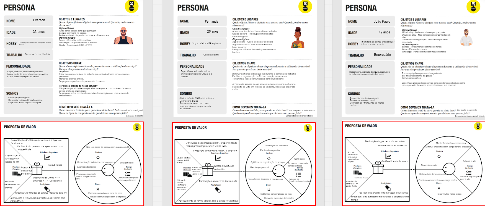
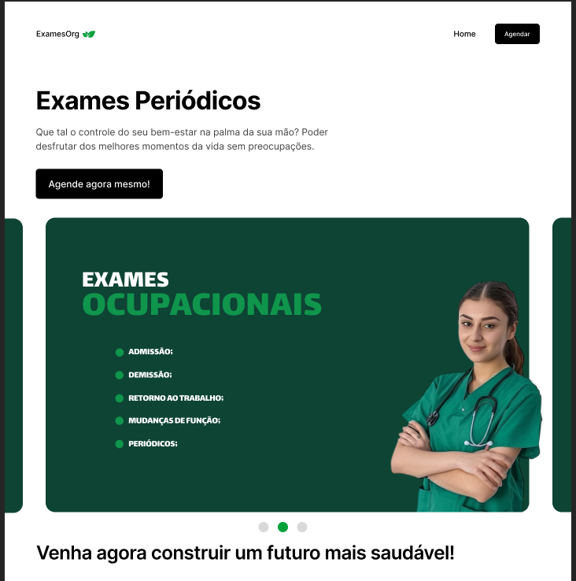
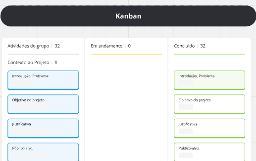

# Introdução

Projeto de organização de exames periódicos 

* **Projeto:** [HexamsOrg]
* **Repositório GitHub:** [https://github.com/ICEI-PUC-Minas-CC-TI/pbh-cc-2024-2-ti1-ti-examesorg.git]
* **Membros da equipe:**
  
  * Izadora Galarza Alves(https://github.com/IzadoraGalarza)
  * Daniel Alves Gonçalves (https://github.com/danielalvesbr)
  * Rafael De Sena Sampaio (https://github.com/rafasnna)
  * Felipe Silva Barros(https://github.com/FelipeBarros2)
  * Felipe De Oliveira Mafra(https://github.com/Felipe-Mafra)
  * Mateus Esteves Reis(https://github.com/mts-design)


A documentação do projeto é estruturada da seguinte forma:

1. Introdução
2. Contexto
3. Product Discovery
4. Product Design
5. Metodologia
6. Solução
7. Referências Bibliográficas

✅ [Documentação de Design Thinking (MIRO)] 

# Contexto
O projeto HexamsOrg busca ser uma ferramenta capaz de auxiliar os setores de rh, empresas e os próprio funcionários, peritindo mais tempo e liberdade aos envolvidos, deixando de lado o estresse e a desorganização

## Problema

Tudo começou com a observação dos problemas existentes dentro de uma empresa, principalmente no setor de rh, onde a demanda é muitas vezes excessiva e sofre com problemas de falta de organização, atrapalhando uma boa comunicação funcionário e empresa, além de prejudica os próprios trabalhadores do rh com serviço extra


## Objetivos

O principal objetivo do HexamsOrg é ser um diferencial dentro do setor de saúde ocupacional, sendo um auxiliar importante dentro das empresas, dando relevância aos funcionários que sofrem com a desorganização de seus setores, e de certa forma, terem que lidar com o problema de forma improvisada e em cima da hora.

Ou seja, o ExamesOrg almeja fornecer uma ferramenta que permita ao setor de recursos humanos analisar dados relacionados à saúde dos colaboradores de maneira eficiente. Com a centralização das informações em um formato acessível, os gestores poderão identificar padrões e tendências, facilitando a tomada de decisões estratégicas em relação à saúde ocupacional. Essa análise não apenas ajudará as empresas a se manterem em conformidade com as legislações, mas também permitirá que elas implementem melhorias contínuas, promovendo o bem-estar dos colaboradores e, consequentemente, um ambiente de trabalho mais produtivo.

## Justificativa

A justificativa para o projeto é a importância que a realização de exames períodicos possui na vida dos trabalhadores e da empresa, afinal é uma obrigação ordenada por lei.
Além disso, isso é uma segurança dada ao funcionário, uma preocupação que deve existir anuma relação empresa-funcionário.

A justificativa para o desenvolvimento do projeto ExamesOrg está fundamentada na crescente necessidade de as empresas cumprirem rigorosamente as obrigações legais relacionadas à saúde ocupacional. Com a legislação exigindo a realização de exames periódicos, torna-se imprescindível que as organizações estabeleçam processos eficazes para gerenciar essas demandas. A falta de conformidade pode resultar em penalidades legais e, mais importante, em riscos à saúde dos colaboradores, o que ressalta a urgência de uma solução inovadora.

Além disso, a comunicação deficiente entre o setor de recursos humanos e os funcionários é um desafio recorrente nas empresas. Muitas vezes, os colaboradores não estão cientes das datas e da importância dos exames, o que pode levar a atrasos e à falta de realização. O ExamesOrg foi concebido para enfrentar esse problema, proporcionando um meio eficaz de comunicação e lembretes automatizados, garantindo que todos os envolvidos estejam alinhados e cientes de suas responsabilidades.

Por fim, investir em uma ferramenta como o ExamesOrg não apenas melhora a gestão dos exames, mas também contribui para a construção de uma cultura organizacional que valoriza a saúde e o bem-estar dos colaboradores. Um ambiente de trabalho que prioriza a saúde ocupacional tende a ser mais produtivo, resultando em colaboradores mais engajados e satisfeitos. Assim, a implementação do ExamesOrg se justifica não apenas pela necessidade de conformidade legal, mas também pela oportunidade de promover um ambiente de trabalho mais saudável e colaborativo, beneficiando tanto as empresas quanto seus funcionários.

## Público-Alvo

*Setor de Recursos Humanos
O setor de recursos humanos é crucial para a gestão eficaz da saúde ocupacional dentro das organizações. Esses profissionais são responsáveis por garantir que a empresa cumpra as obrigações legais relacionadas aos exames periódicos, monitorando a saúde dos colaboradores e implementando políticas que promovam um ambiente de trabalho seguro. Com a crescente complexidade das legislações trabalhistas, a necessidade de ferramentas que auxiliem na organização e na comunicação se torna ainda mais evidente.
O ExamesOrg é um recurso valioso para o RH, pois oferece uma plataforma que centraliza informações, facilitando o agendamento dos exames. Essa eficiência permite que os profissionais se concentrem em tarefas estratégicas, ao invés de se perderem em atividades administrativas. Ao melhorar a gestão dos exames, o ExamesOrg também ajuda o RH a mitigar riscos legais e a promover uma cultura de saúde dentro da empresa.


*Trabalhadores
Os trabalhadores são o coração de qualquer organização e, portanto, devem ter acesso a um ambiente seguro e saudável. A realização regular de exames periódicos é essencial para detectar precocemente problemas de saúde que podem ser agravados pelas condições de trabalho. Muitos colaboradores, no entanto, não estão cientes da importância desses exames ou das datas em que devem ser realizados, o que pode levar a consequências negativas para sua saúde.
Ao direcionar o ExamesOrg para os trabalhadores, a plataforma busca facilitar a comunicação sobre os exames, disponibilizando informações relevantes. Essa abordagem garante que os colaboradores estejam informados e motivados a participar ativamente de sua saúde ocupacional, contribuindo para um ambiente de trabalho mais seguro e promovendo seu bem- estar geral.


*Empresários
Os empresários desempenham um papel fundamental na criação de ambientes de trabalho que priorizam a saúde e a segurança de seus colaboradores. Eles são responsáveis por implementar políticas de saúde ocupacional e garantir que as normas legais sejam seguidas. No entanto, a falta de ferramentas adequadas pode levar a uma gestão ineficiente dos exames periódicos, resultando em riscos legais e à saúde dos funcionários. O ExamesOrg se apresenta como uma solução prática para empresários que desejam otimizar a gestão de saúde dentro de suas organizações. Com a automação e a centralização das informações, os empresários podem reduzir custos, melhorar a conformidade legal e, ao mesmo tempo, demonstrar um compromisso genuíno com o bem-estar de seus colaboradores. Isso, por sua vez, pode resultar em maior satisfação e produtividade dos funcionários.


*Clínicas de Trabalho
As clínicas de trabalho são responsáveis por realizar os exames periódicos e garantir que os colaboradores estejam em condições adequadas para desempenhar suas funções. Elas desempenham um papel vital na saúde ocupacional, mas muitas vezes enfrentam desafios relacionados à comunicação com as empresas e à gestão dos agendamentos. Isso pode resultar em atrasos e na falta de acompanhamento necessário para garantir que todos os exames sejam realizados corretamente.

O ExamesOrg é uma ferramenta que facilita essa comunicação, permitindo que as clínicas recebam informações organizadas sobre os colaboradores que precisam realizar exames. Com a organização das informações e um sistema centralizado, as clínicas podem melhorar sua eficiência operacional, garantindo que os exames sejam realizados dentro do prazo e de forma adequada. Isso não apenas beneficia as clínicas, mas também contribui para a saúde geral dos trabalhadores.


*Técnicos de Segurança do Trabalho
Os técnicos de segurança do trabalho são responsáveis por identificar e minimizar os riscos no ambiente laboral, garantindo que as condições de trabalho sejam seguras para todos os colaboradores. Eles desempenham um papel essencial na promoção da saúde ocupacional, realizando avaliações e implementando medidas preventivas. No entanto, a falta de comunicação eficaz sobre os exames periódicos pode dificultar sua capacidade de monitorar a saúde dos funcionários.

O ExamesOrg se torna um aliado importante para os técnicos de segurança, pois oferece uma plataforma que centraliza as informações sobre os exames e facilita a comunicação com o RH e os colaboradores. Com acesso a dados atualizados, os técnicos podem identificar rapidamente quais funcionários precisam realizar exames, garantindo que as medidas de segurança sejam implementadas de forma eficaz. Isso contribui para um ambiente de trabalho mais seguro e saudável, alinhando-se aos objetivos dos profissionais de segurança.


  
# Product Discovery

## Etapa de Entendimento

> * **Matriz CSD**:
>
> * Certezas :
>   - O problema em questão é uma dificuldade real dentro dos gerenciamentos das grandes empresas
    - Não é um assunto priorizado dentro dos recursos humanos de uma empresa
    - Essa falta de gerenciamento afeta tanto a empresa, quanto os colaboradores (funcionários).
> * Suposições:
>  - Facilitará a demanda do RH (recursos humanos).
   - Tornará mais eficiente a comunicação empresa-trabalhador.
   - Promoverá uma boa relação com as clinicas que realizam exames periodicos.
 * Dúvidas:
   - Somente o RH terá acesso ou os colaboradores também?
   - Seria útil que criar uma aba que conecte a empresa com uma clinica? 
   - Seria possível realizar o agendamento de forma automática na clinica caso a empresa optasse por isso?
  
> * **Mapa de stakeholders**:
> - Pessoas Fundamentais.
    Setor de RH
    Funcionários
> - Pessoas Importantes
    Gestores
    Clínicas ocupacionais
> - Pessoas Influenciadoras
    Empresários
    Sindicatos
    Seguranças do trabalho
> * **Entrevistas qualitativas**:
>   *Pergunta 1 - A sua empresa possui uma clínica própria ou terceirizada? Se a segunda opção, já teve problemas com a marcação na clínica ?
>   Resposta :
>      Todos os entrevistados afirmaram que a empresa em que trabalha possui outra empresa responsável.
>      Dois entrevistados responderam que não possuíram nenhum tipo de problema com marcação.
>      Três entrevistados afirmaram que já tiveram problemas com esse assunto, sendo avisados de última hora.
>   
>   *Pergunta 2 - Você acredita que a comunicação empresa-funcionario  seria melhor com o auxílio de um site para descomplicar processos de exame?
>    Resposta:
>    Todos os cinco entrevistados acreditam que o site seria uma boa "aposta" para melhorar o relacionamento empresa-funcionario.
>   
>   *Pergunta 3 - Você acredita que criando um site para esse tipo de problema, tiraria a demanda excessiva do RH?
>    Resposta:
>    Dentre todas as respostas, a grande maioria falou que acredita que diminuiria a demanda, mas reforçou a ideia de que a maioria das empresas já possuem uma contratada para isso.
>   
>   *Pergunta 4 - Qual o seu pensamento sobre conectar as clínicas e o setor responsável pela marcação de exame? Justifique
>    Resposta: De forma geral, os entrevistados gostaram da ideia, mas ainda sim acreditam que deveria ser visto com mais cuidado esse aspecto, visando o deslocamento.
>   
>   *Pergunta 5 - Como funcionário, gostaria de ser avisado previamente e de maneira organizada quando marcado o exame? Enquanto RH, acha que seria efeciente receber notificações antes do vencimento do exame?
>    Resposta:
>    Os entrevistados acreditam que seria bom avisar os funcionários 30 dias antes, e após isso avisar constantemente até a data do exame. Já com o RH disseram a mesma coisa.
>   
>   *Pergunta 6 - Por fim, qual o seu pensamento sobre criar um site justamente para diminuir demandas, facilitar e tornar exigente a marcação de exames ? Tem alguma coisa a acrescentar?
>    Resposta:
>    Todos responderam de forma especifica que seria uma forma mais organizada de controlar as agendas, tornando uma coisa não só do RH. Além disso, seria útil para a empresa e interessante, viável e facilitador.
>   
> * **Highlights de pesquisa**: um compilado do levantamento realizado por meio das entrevistas.
>   Entrevistados: RH, Funcionários e donos
>   Local: Empresa
>   Data: 28/08 - 31/08
>
> 1- O que os participantes falaram ou fizeram que surpreendeu, ou falas mais significativas.
> -> O que mais surpreendeu foi a iniciativa de alguns participantes em falar sobre o assunto, e descobrimos que varia muito esse problema, e que diferentemente do que havia dado como certeza, as empresas médias e pequenas possuem mais problemas com isso.
>
> 2- Aspectos que importaram mais para os participantes
> ->  Criação do site em si.
      Achar formar de facilitar a marcação com a clínica.
      Evitar erros constantes relacionados aos exames e buscar precisão.
>
> 3-Principais temas ou aprendizados que surgiram desta entrevista
> -> Assuntos como a sobrecarga do RH
     A demora dentro das clínicas de trabalho
     Variáveis que pode ocorrer dentro do site com o RH com a clínica
>
> 4- Novos tópicos ou questões para explorar no futuro
-> Uma coisa falada que chamou a atenção do grupo foi justamente o tempo que o funcionário gasta em ir na clínica e o tempo de espera. Ou seja, buscar uma forma de otimizar o tempo , evitando atrasos de marcação, além de controlar o tempo. Outra coisa é a criação dentro do site com um calendário disponibilizado pela clínica para a empresa.

## Etapa de Definição

### Personas

 Everson (Funcionário) - Constantemente precisa realizar exames períodicos e sempre ocorre algum imprevisto por parte da empresa ou clínica.
 Objetos físicos:
 - Anda com o celular para qualquer lugar
 - Sempre com boné na cabeça
 - Botina ou chinelo dependendo do local - Rua ou casa
 Objetos digitais:
 - Banco  - Consultar saldo e salário
 - WhatsApp - Grupos de família e trabalho
 - Gov.br - Assuntos de INSS e FGTS

Objetivos:
 - Evitar transtornos no local de trabalho por conta de atrasos com os exames periódicos.
 - Manter os exames em dia.
 - Se programar previamente para a data do exame

Por que ele precisa do nosso serviço?
 - Não passar por situações complicadas na empresa, como o atraso de exame devido a falta de organização
 - Se preparar antes, recebendo um aviso da marcação com uma semana de antecedência.

Fernanda (Gestora de rh) - Se sente sobrecarregada com as altas demandas do RH e acaba errando em detalhes que requerem organização e tempo, como marcação de exames.
 Objetos físicos:
 - Adora usar terninho - Usa muito no trabalho
 - Óculos escuro - Preocupa com cuidados dermatológicos
 Objetos digitais:
 - App de dieta - Gosta de cuidar do corpo
 - App de música - Ouve música em todo lugar possível
 - Instagram - Postar foto de lugares e coisas bonitas


 Objetivos: 
 - Diminuir as horas extras que faz durante a semana no trabalho
 - Facilitar a organização do RH em relação aos exames
 - Tornar mais fácil a comunicação com o funcionário

 Por que ele precisa do nosso serviço?
  - A Fernanda precisa desse serviço justamente para melhorar a qualidade de vida em relação ao trabalho, coisa que ela preza muito.

 Jõao Paulo (Empresário) - Dono de uma empresa que possui uma quantidade de funcionário e procura melhorar o desempenho, necessitando de um bom RH.
  Objetos físicos:
  - Moto harley - Anda com ela sempre que pode
  - Óculos de grau - Não consegue enxergar nada sem eles
  - Celular de última geração - Precisa sempre estar conectado
 Objetos digitais:
  - Bancos - Investimento e controle de renda
  - Waze - Para se locomover
  - Whatsapp - Para se comunicar frequentemente
 
  Objetivos:
  - Tornar a própria empresa mais organizada
  - Ser influente no ramo de gestão
  - Ter funcionários fiéis

Por que ele precisa do nosso serviço?
  - João Paulo precisa desse serviço para atender seus objetivos como um empresário, buscando sempre fortalecer sua empresa


 - Everson
 - Fernanda
 - Jõao Paulo


# Product Design

## Histórias de Usuários

Com base na análise das personas foram identificadas as seguintes histórias de usuários:

| Eu como: Funcionário
Quero: Organização do setor de recursos humanos em relação aos exames periódicos.
Porque/Para : Não ter nenhum problema tanto na área de serviço, quanto com a empresa.

| Eu como: Contratada de RH
Quero: Um sistema que possa diminuir a demanda do setor, além de ser prático para o dia a dia.
Porque: A falta organização em alguns requisitos prejudica tanto o RH, quanto o funcionário e a empresa, além de aumentar o tempo de trabalho.

| Eu como: Empresário e dono de empresa Quero: Uma ferramenta capaz de organizar de forma funcional a minha equipe de recursos humanos e melhorar o desempenho dos meus funcionários de obra.
Porque/Para: Preciso tornar a minha empresa de renome, reconhecida pela eficiência e organização.

| Eu como:  Secretária de clínica
Quero: Que não haja problemas de exames com as empresas
Porque/Para : que não ocorra nenhum problema, como o encaixe de última hora, desorganização e falta de entendimento dos funcionários avisados próximo do dia do exame.

## Proposta de Valor

*✳✳✳ APRESENTE O DIAGRAMA DA PROPOSTA DE VALOR PARA CADA PERSONA ✳✳✳*

##### Proposta para Persona




### Requisitos Funcionais


|RF-01 - O site possui um carrossel na página inicial com informações.

|RF-02 - Página de cadastro de empresa.

|RF-03 - Página de cadastro de funcionário, que gera uma planilha para ser instalada após o cadastro.

|RF-04 – Captcha de verificação.

|RF-05 - Página de pagamento.

|RF-06 - Página de administração.

|RF-07 - Página de planos disponíveis pelo ExamesOrg.

|RF-08 – Mapa de clínicas próximas.

|RF-09 - Gráfico de proximidade das clínicas.

|RF-10 – Localizador para a adequação dos valores de cada região.

|RF-11 - Página de suporte.

|RF-12 - Calendário na página de cadastro de funcionários.


### Requisitos não Funcionais


|RNF-01 – Responsividade.

|RNF-02 - Disponível durante 24/07 dias.

|RNF-03 – Acessibilidade de alto contraste e aumento de letra.

|RNF-04 - Disponível no GitHub.


## Projeto de Interface

Artefatos relacionados com a interface e a interacão do usuário na proposta de solução.

### Wireframes

Estes são os protótipos de telas do sistema.

##### TELA PRINCIPAL

O Primórdio do site contendo informações gerais




### User Flow


### Protótipo Interativo


✅ [Protótipo Interativo (FIGMA)](https://www.figma.com/proto/mMST96mdrdGOgBwI9YQXGZ/TI?node-id=0-1&t=AtegAwHmRx90OWUU-1)


# Metodologia

Detalhes sobre a organização do grupo e o ferramental empregado.

## Ferramentas

Relação de ferramentas empregadas pelo grupo durante o projeto.

| Ambiente                    | Plataforma | Link de acesso                                     |
| --------------------------- | ---------- | -------------------------------------------------- |
| Processo de Design Thinking | Miro       | https://miro.com/app/board/uXjVKmcdvuE=/?share_link_id=826190493922                      |
| Repositório de código       | GitHub     | https://github.com/ICEI-PUC-Minas-CC-TI/pbh-cc-2024-2-ti1-ti-examesorg                   |
| Hospedagem do site          | Vercel     | https://pbh-cc-2024-2-ti1-ti-examesorg.vercel.app/                                       |
| Protótipo Interativo        | MarvelApp  | https://www.figma.com/design/mMST96mdrdGOgBwI9YQXGZ/TI?node-id=0-1&t=ZjNUpPMnBdDQVjI7-1  |
xxxxxxxxxxxxxxxxxxxxxxxxxxxxxxxxxxxxxxxxxxxxxxxxxxxxxxxxxxxxxxxxxxxxxxxxxxxxxxxxxxxxxxxxxxxxxxxxxxxxxxxxxxxxxxxxxxxxxxxxxxxxxxxxxxxxxxx

## Gerenciamento do Projeto

Divisão de papéis no grupo e apresentação da estrutura da ferramenta de controle de tarefas (Kanban).



[Kanban link (Miro)](https://miro.com/app/board/uXjVLcTighs=/)

# Solução Implementada

Esta seção apresenta todos os detalhes da solução criada no projeto.

## Vídeo do Projeto

O vídeo a seguir traz uma apresentação do problema que a equipe está tratando e a proposta de solução. ⚠️ EXEMPLO ⚠️

[](https://www.youtube.com/embed/70gGoFyGeqQ)

> ⚠️ **APAGUE ESSA PARTE ANTES DE ENTREGAR SEU TRABALHO**
>
> O video de apresentação é voltado para que o público externo possa conhecer a solução. O formato é livre, sendo importante que seja apresentado o problema e a solução numa linguagem descomplicada e direta.
>
> Inclua um link para o vídeo do projeto.

## Funcionalidades

Esta seção apresenta as funcionalidades da solução.Info

##### Funcionalidade 1 - Cadastro de Contatos ⚠️ EXEMPLO ⚠️

Permite a inclusão, leitura, alteração e exclusão de contatos para o sistema

* **Estrutura de dados:** [Contatos](#ti_ed_contatos)
* **Instruções de acesso:**
  * Abra o site e efetue o login
  * Acesse o menu principal e escolha a opção Cadastros
  * Em seguida, escolha a opção Contatos
* **Tela da funcionalidade**:


> ⚠️ **APAGUE ESSA PARTE ANTES DE ENTREGAR SEU TRABALHO**
>
> Apresente cada uma das funcionalidades que a aplicação fornece tanto para os usuários quanto aos administradores da solução.
>
> Inclua, para cada funcionalidade, itens como: (1) titulos e descrição da funcionalidade; (2) Estrutura de dados associada; (3) o detalhe sobre as instruções de acesso e uso.

## Estruturas de Dados

Descrição das estruturas de dados utilizadas na solução com exemplos no formato JSON.Info

##### Estrutura de Dados - Contatos   ⚠️ EXEMPLO ⚠️

Contatos da aplicação

```json
  {
    "id": 1,
    "nome": "Leanne Graham",
    "cidade": "Belo Horizonte",
    "categoria": "amigos",
    "email": "Sincere@april.biz",
    "telefone": "1-770-736-8031",
    "website": "hildegard.org"
  }
  
```

##### Estrutura de Dados - Usuários  ⚠️ EXEMPLO ⚠️

Registro dos usuários do sistema utilizados para login e para o perfil do sistema

```json
  {
    id: "eed55b91-45be-4f2c-81bc-7686135503f9",
    email: "admin@abc.com",
    id: "eed55b91-45be-4f2c-81bc-7686135503f9",
    login: "admin",
    nome: "Administrador do Sistema",
    senha: "123"
  }
```

> ⚠️ **APAGUE ESSA PARTE ANTES DE ENTREGAR SEU TRABALHO**
>
> Apresente as estruturas de dados utilizadas na solução tanto para dados utilizados na essência da aplicação quanto outras estruturas que foram criadas para algum tipo de configuração
>
> Nomeie a estrutura, coloque uma descrição sucinta e apresente um exemplo em formato JSON.
>
> **Orientações:**
>
> * [JSON Introduction](https://www.w3schools.com/js/js_json_intro.asp)
> * [Trabalhando com JSON - Aprendendo desenvolvimento web | MDN](https://developer.mozilla.org/pt-BR/docs/Learn/JavaScript/Objects/JSON)

## Módulos e APIs

Esta seção apresenta os módulos e APIs utilizados na solução

**Images**:

* Unsplash - [https://unsplash.com/](https://unsplash.com/) ⚠️ EXEMPLO ⚠️

**Fonts:**

* Icons Font Face - [https://fontawesome.com/](https://fontawesome.com/) ⚠️ EXEMPLO ⚠️

**Scripts:**

* jQuery - [http://www.jquery.com/](http://www.jquery.com/) ⚠️ EXEMPLO ⚠️
* Bootstrap 4 - [http://getbootstrap.com/](http://getbootstrap.com/) ⚠️ EXEMPLO ⚠️

> ⚠️ **APAGUE ESSA PARTE ANTES DE ENTREGAR SEU TRABALHO**
>
> Apresente os módulos e APIs utilizados no desenvolvimento da solução. Inclua itens como: (1) Frameworks, bibliotecas, módulos, etc. utilizados no desenvolvimento da solução; (2) APIs utilizadas para acesso a dados, serviços, etc.

# Referências

As referências utilizadas no trabalho foram:

* SOBRENOME, Nome do autor. Título da obra. 8. ed. Cidade: Editora, 2000. 287 p ⚠️ EXEMPLO ⚠️

> ⚠️ **APAGUE ESSA PARTE ANTES DE ENTREGAR SEU TRABALHO**
>
> Inclua todas as referências (livros, artigos, sites, etc) utilizados no desenvolvimento do trabalho.
>
> **Orientações**:
>
> - [Formato ABNT](https://www.normastecnicas.com/abnt/trabalhos-academicos/referencias/)
> - [Referências Bibliográficas da ABNT](https://comunidade.rockcontent.com/referencia-bibliografica-abnt/)
